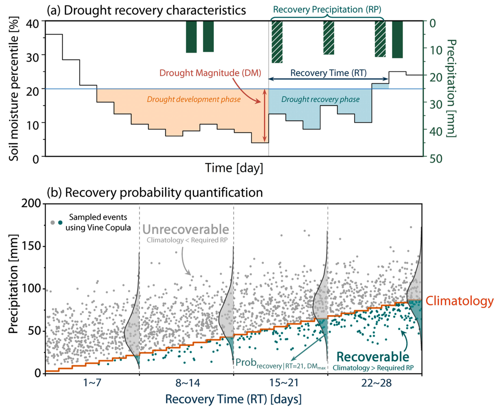

# Probabilistic Assessment of Global Drought Recovery and Its Response to Precipitation Changes

This repository contains the Python scripts to quantify global drought recovery probability based on a Vine-Copula framework, introduced in the [AGU 2024](https://agupubs.onlinelibrary.wiley.com/doi/full/10.1029/2023GL106067) paper:

*<center>"Probabilistic Assessment of Global Drought Recovery and Its Response to Precipitation Changes"</center>*

</br>

<center>

</center>

## Usage
The scripts should be executed in the following order:

#### 1. `global_drought_events.py`
Loads the data and extracts characteristics of drought events.

#### 2. `find_severe_droughts.py`
Identifies the most severe drought event for each grid during the past 66 years (1951-2016).

#### 3. `global_drought_recovery_probability.py`
(1) Calculates the likelihoods of drought recovery in both historcial (1951-1983) and present (1984-2016) periods. <br />
(2) Evaluates whether changes in recovery probability between historical and present periods are statistically significant.

#### 4. `elasticity_analysis.py`
Calculates the response of drought recovery probability to precipitation changes.

#### 5. `plot.py`
(1) Plots the global recovery probability. <br/>
(2) Plots the relative changes in recovery probability between historical and present periods at subcontinent scales. <br/>
(3) Plots the response of drought recovery probability to precipitation changes under various climate scenarios.

## Citation
If you use this work, please consider citing our paper:

```bibtex
@article{zhang2024probabilistic,
  title={Probabilistic assessment of global drought recovery and its response to precipitation changes},
  author={Zhang, Limin and Yuan, Fei and He, Xiaogang},
  journal={Geophysical Research Letters},
  volume={51},
  number={1},
  pages={e2023GL106067},
  year={2024},
  publisher={Wiley Online Library}
}
```

## Code License
This work is licensed under the GNU General Public License v3.0. For more details, please refer to `LICENSE.txt`.
